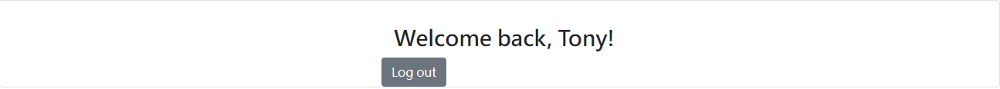

# user authentication 使用者認證

## 介紹


**使用者在表單裡輸入帳密：email & password**
***

**登入成功頁面**
***

**登入失敗頁面**
***
## 開始使用

1. 請先確認有安裝 node.js 與 npm
2. 將專案 clone 到本地
```
https://github.com/happygod119/user-authentication.git
```
3. 安裝 npm 套件

```
npm install
```

4. 引入種子資料

```
npm run seed
```

5. 執行程式

```
npm run start
```

6.若出現此行網址代表運行順利

```
http://localhost:3000
```

## 開發工具

- Node.js 14.16.0
- Express 4.17.2
- Express-Handlebars 4.0.2
- MongoDB
- mongoose 6.1.8
- method-override 3.0.0
- Bootstrap 5.1.1

